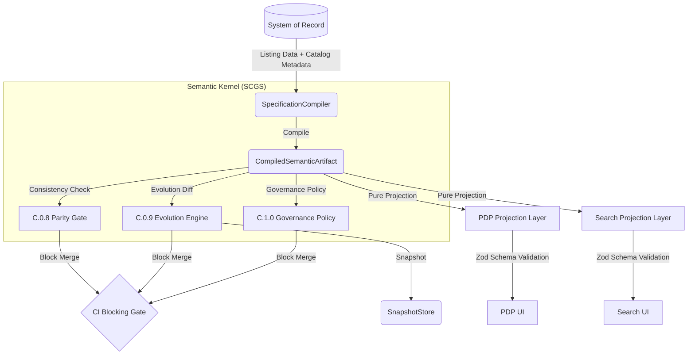

# SCGS Architecture & Governance

This document defines the **Semantic Compiler Governance System (SCGS)**. This is the immutable architecture of the catalog specification lifecycle. **No deviations from this architecture are permitted.**

## 1. Architectural Overview

The system treats catalog specifications not as "feature logic" but as **compiled artifacts**. All semantics are defined once and projected onto consumers.

## 2. Enforcement Boundaries

| Layer | Responsibility | Invariant |
| :--- | :--- | :--- |
| **Semantic Kernel** | Data fetching, Compilation, Normalization | Only place where domain logic exists. |
| **Governance (SCGS)** | Parity (C0.8), Evolution (C0.9), Governance (C1.0) | Pure evaluation of compiled artifacts. |
| **Projection Layer** | Structural reshaping for UI | Pure functions only; strictly no domain logic. |
| **Schema Layer** | Contract validation | All outputs must satisfy Zod-defined contracts. |

## 3. Strict Prohibitions

1.  **No Interpretation Surfaces**: Consumers (PDP/Search/UI) MUST NOT compute facets, groups, or display orders.
2.  **No Builder Logic**: Consumers MUST NOT use "Builder" patterns to hydrate ViewModels. Use pure projection functions.
3.  **No Bypass**: All semantic changes MUST pass the `SCGS` gate in CI.
4.  **Immutability**: Historical artifacts in the `SnapshotStore` are read-only in CI.

## 4. How to Evolve

To change catalog semantics:
1.  **Compiler**: Update `SpecificationCompiler` to reflect the new definition.
2.  **Artifacts**: Generate a new artifact and update snapshots (`vitest -u`).
3.  **Documentation**: Update `CERTIFIED_SYSTEM_CHANGELOG.md` with justification.
4.  **Governance**: If the change is breaking (e.g., facet removal), adjust `GovernancePolicy` or resolve the violation in CI.

## 5. Frontend Semantic Drift Firewall

UI components are prohibited from performing semantic interpretation. All data consumed by UI must be pre-projected by the `SCGSReadModel` or defined `Projection` layer.

### 5.1 Enforcement Rules
1. **Purity Contract**: UI components MUST NOT contain:
   - `sort(`, `filter(`, `reduce(`, `groupBy`
   - Ad-hoc threshold logic (e.g., `score > 80 ? 'green' : 'red'`)
   - Semantic drift derivation logic
2. **Schema Binding**: All UI props must conform strictly to `SCGSReadModel` sub-projections.
3. **CI Enforcement**: The `scgs:prr` gate scans UI components for forbidden semantic patterns and BLOCKS on any detected leakage.
