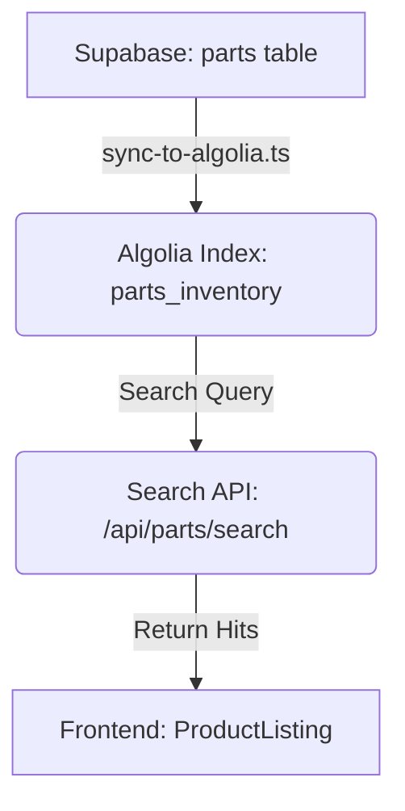

# SEARCH_DATA_FLOW.md

## Current Data Pipeline

## Step-by-Step Breakdown

| Step | Component | Source/Transform |
| ---- | --------- | ---------------- |
| 1. Indexing | `scripts/sync-to-algolia.ts` | Selects from `parts` table + related tables, denormalizes into Algolia record structure. |
| 2. Search | `api/parts/search` | Executes Algolia search query based on filter payload. |
| 3. Rendering| `src/components/ProductListing` | Receives raw hit data, sorts locally, and renders. |

**Current Limitation:** The pipeline does not currently return facet metadata to the frontend, necessitating local counting and filtering logic that should be handled by Algolia.
